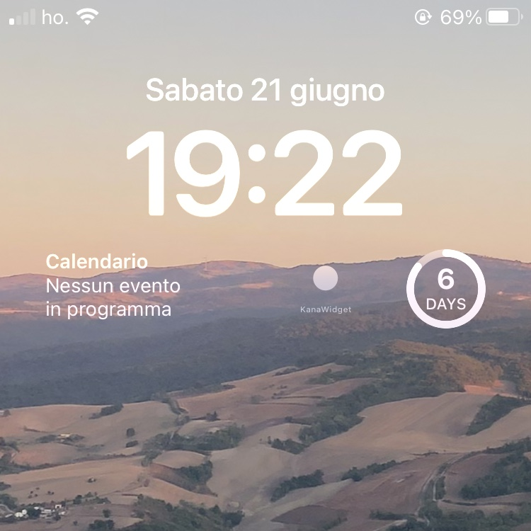

# Screenshots
| Widget ON | Widget OFF |
|-----------|-----------|
|  |  |

# Info & Features
- This widget is meant to be used solely on lock screen
- You can choose which groups to keep active (Katakana, Hiragana or Both)
- Lightweight (tested on Iphone 8)
- refresh every minute(ish) by default
- click on the character to open it in the browser

# How to install
### Manual installation
1) Download [Scriptable app](https://scriptable.app/)
2) Open Scriptable, click + in the top right
3) Quit the app
4) Open this repo and Search for KanaWidget.js
5) Back in the app, copy the content of this file and paste the KanaWidget.js text in your new "Untitled Script" (click on the three dots)
6) Quit the Sciptable app
7) Swipe down to your notification center and long press on your wallpaper
8) Choose "Customize" under your lockscreen, then your lockscreen
9) Click under your clock and add the scriptable widget (the small one)
10) Click on your new added widget, now select your untitled script for "script". When interacting should be set to "Run script"

# Tweaks
### Groups
You can choose wich groups are shown by manually editing these lines:
```javascript
// ========================
// CONFIG - true to activate, false to deactivate
// ========================

const USE_HIRAGANA_BASE = true;
const USE_KATAKANA_BASE = false;
const USE_DAKUTEN = false; // が - ぢ
const USE_HANDADAKUTEN = false; // ぱ - ぴ
```
### Time
You can choose to appreciate a little more your characters by scrolling all the way down to the bottom of this script and modify the last value (1 = 1 minute in this case):
```javascript
widget.refreshAfterDate = new Date(Date.now() + 1000 * 60 * 1);
```
